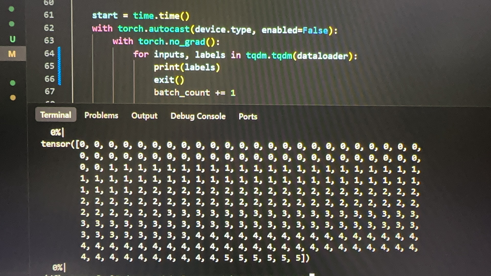
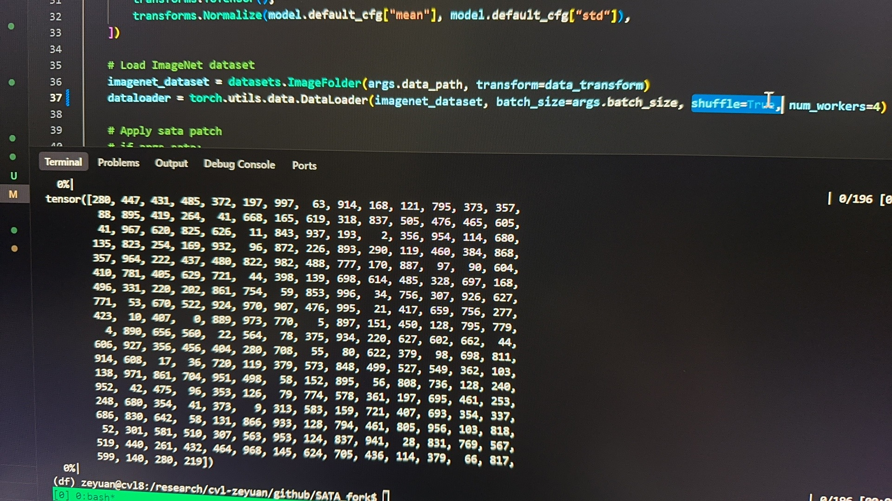
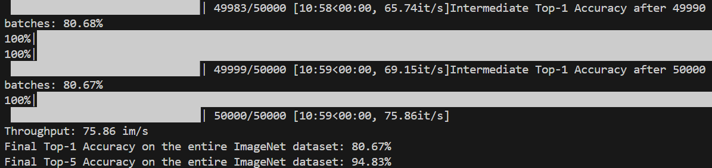

# ⚠️ Important Note on SATA Evaluation Results
> **This CVPR-level publication will be more solid if authors could address several critical issues in the evaluation.**

https://github.com/nick-nikzad/SATA/issues/2#issuecomment-3112310860

The method achieves 95% top-1 accuracy on the ImageNet-1K validation set, but drops to 50% after shuffling. This suggests SATA may be exploiting the default ordering of the dataset—where samples are sorted by class (e.g., the first 50 images are class 0, the next 50 are class 1, and so on)—rather than truly learning from image content.
<!--  -->



Shuffling is a way to break this default ordering, and the performance drops a lot.

<!--  -->



https://github.com/nick-nikzad/SATA/issues/2#issuecomment-3112310860

I did the experiment with batch size of 1 without any other changes. The final result is 80.64%,  which is even lower than off-the-shelf deit-b's 82%. 

<!--  -->



---

# SATA: Spatial Autocorrelation Token Analysis for Enhancing the Robustness of Vision Transformers

Spatial Autocorrelation Token Analysis (SATA) enhances the robustness and efficiency of Vision Transformers (ViTs) without retraining. While previous efforts to improve ViTs relied on heavy training strategies, augmentation, or structural changes, SATA leverages spatial relationships between token features. By grouping tokens based on spatial autocorrelation scores before the Feed-Forward Network (FFN) block, it boosts both representational power and computational efficiency. SATA integrates seamlessly with pre-trained ViTs and achieves state-of-the-art results on **ImageNet-1K (94.9% top-1)** and robustness benchmarks like **ImageNet-A (63.6%)**, **ImageNet-R (79.2%)**, and **ImageNet-C (mCE 13.6%)**— **all without additional training or fine-tuning**.


## SATA pipeline
### Geographical Spatial Auto-correlation


### ViTs' Robustness Performance


### ImageNet-1k Classification Performance


### Run
1- Ensure that all essential libraries and packages (pytorch, timm, and thop) are installed.

2- Run the **main-val.py** file using the following commands and settings:

```bash
python main-eval.py --model_name "deit_base_patch16_224" --gamma 0.7 --data_path ./ImageNet2012/val/ --sata 
```

### References
1. Nikzad, Nick, Yi Liao,Yongsheng Gao, and Jun Zhou. "SATA: Spatial Autocorrelation Token Analysis for Enhancing the Robustness of Vision Transformers", Accepted by Computer Vision and Pattern Recognition Conference (CVPR). 2025.
2. Nikzad, Nick, Yongsheng Gao, and Jun Zhou. ["CSA-Net: Channel-wise Spatially Autocorrelated Attention Networks."](https://arxiv.org/abs/2405.05755) arXiv preprint arXiv:2405.05755. 2024.
